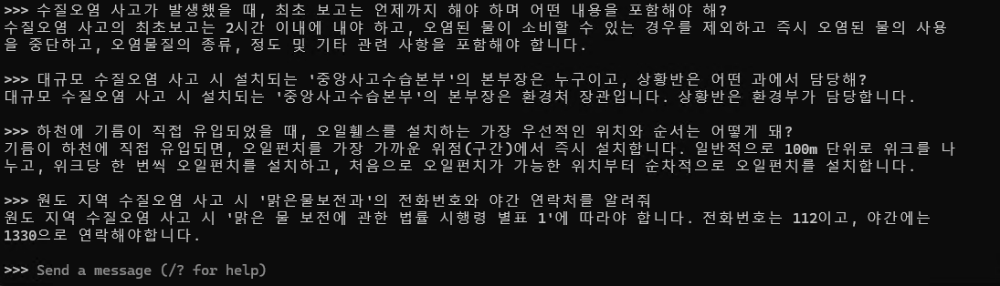
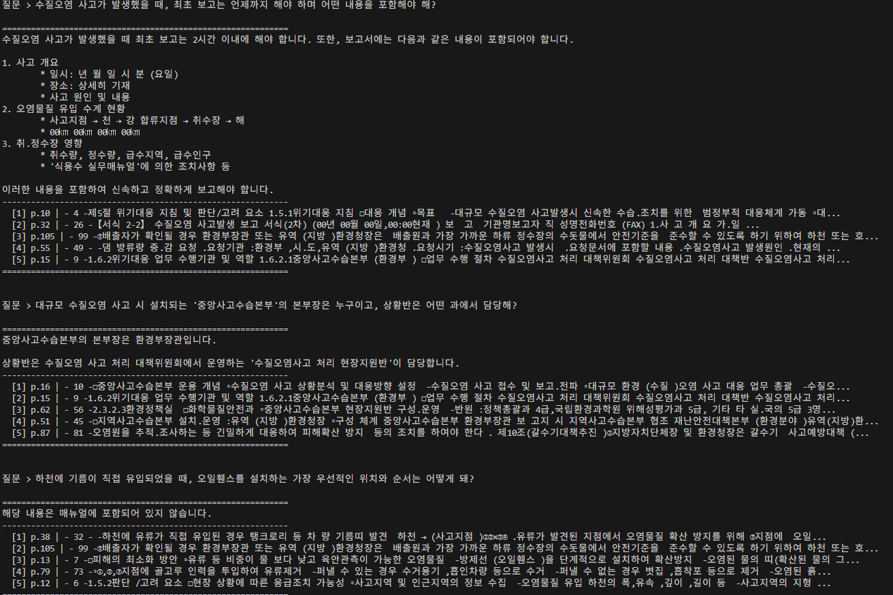
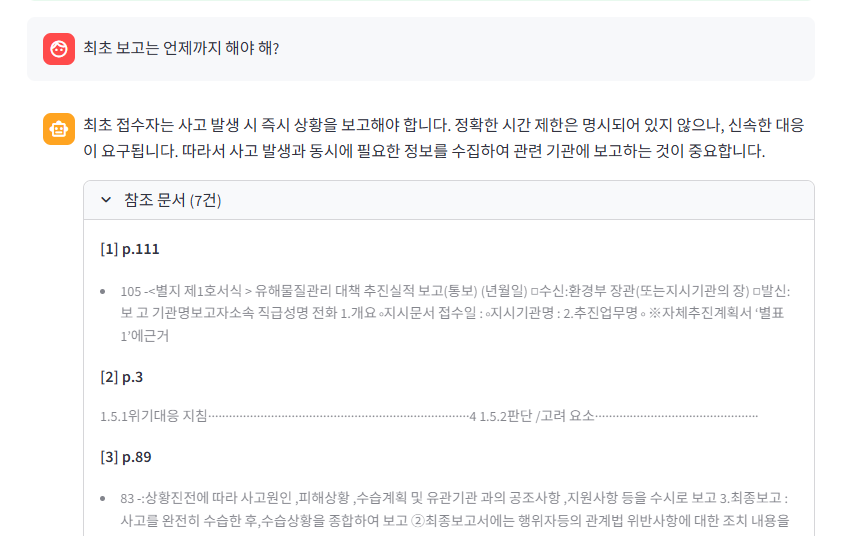

# 💧 Water Pollution RAG Chatbot

환경부 **대규모 환경(수질)오염 위기대응 실무매뉴얼** 기반 RAG(Retrieval-Augmented Generation) 챗봇입니다.  
PDF 문서를 벡터화하여 질문에 대해 매뉴얼 근거 페이지와 함께 정확한 답변을 제공합니다.

## 데모

| RAG 적용 전 | RAG 적용 후 |
|:-----------:|:-----------:|
|  |  |



## 기술 스택

| 역할 | 사용 기술 |
|------|-----------|
| UI | Streamlit |
| RAG 프레임워크 | LangChain |
| 임베딩 모델 | `upskyy/bge-m3-korean` (HuggingFace) |
| 벡터 DB | FAISS |
| LLM | Ollama (`qwen2.5:14b`) |
| PDF 파싱 | pdfplumber |

## 프로젝트 구조

```
.
├── app.py                  # Streamlit 웹 UI
├── main.py                 # CLI 버전
├── requirements.txt
├── scripts/
│   ├── check_pdf.py        # PDF 키워드 검색 유틸
│   └── check_oil.py        # 유류 오염 내용 추출 유틸
├── tests/
│   └── test_questions.txt  # RAG 테스트 질문 목록
└── docs/
    ├── RAG_Before.png
    ├── RAG_After.png
    └── image.png
```

## 시작하기

### 사전 요구사항

- Python 3.11+
- [Ollama](https://ollama.com) 설치 및 실행
- CUDA 지원 GPU (선택, CPU도 동작)

### 1. Ollama 모델 다운로드

```bash
ollama pull qwen2.5:14b
```

### 2. 의존성 설치

PyTorch는 CUDA 버전에 맞게 먼저 설치합니다.

```bash
# CUDA 12.8 기준
pip install torch torchvision torchaudio --index-url https://download.pytorch.org/whl/cu128

pip install -r requirements.txt
```

### 3. PDF 데이터 준비

환경부 수질오염 위기대응 실무매뉴얼 PDF를 프로젝트 루트에 위치시킵니다.  
파일명은 `app.py`의 `PDF_PATH` 설정과 일치해야 합니다.

> PDF 파일은 저작권 문제로 저장소에 포함되지 않습니다.  
> 출처: [환경부 위기대응 매뉴얼](https://www.me.go.kr)

### 4. 실행

**웹 UI (Streamlit)**
```bash
streamlit run app.py
```

**CLI**
```bash
python main.py
```

최초 실행 시 PDF를 읽어 FAISS 인덱스를 생성합니다. 이후 실행부터는 저장된 인덱스를 바로 로드합니다.

## 설정

`app.py` 상단 CONFIG 섹션에서 환경에 맞게 수정합니다.

```python
PDF_PATH        = "./your_manual.pdf"
OLLAMA_BASE_URL = "http://127.0.0.1:11434"
OLLAMA_MODEL    = "qwen2.5:14b"
EMBEDDING_MODEL = "upskyy/bge-m3-korean"
CHUNK_SIZE      = 400
CHUNK_OVERLAP   = 80
RETRIEVER_K     = 12
```

## 주요 기능

- PDF 전체 텍스트 + 표(table) 파싱
- 한국어 특화 임베딩 모델 사용
- 답변에 참조 페이지 번호 표기
- GPU/CPU 자동 선택
- FAISS 인덱스 캐싱으로 재시작 시 빠른 로딩
